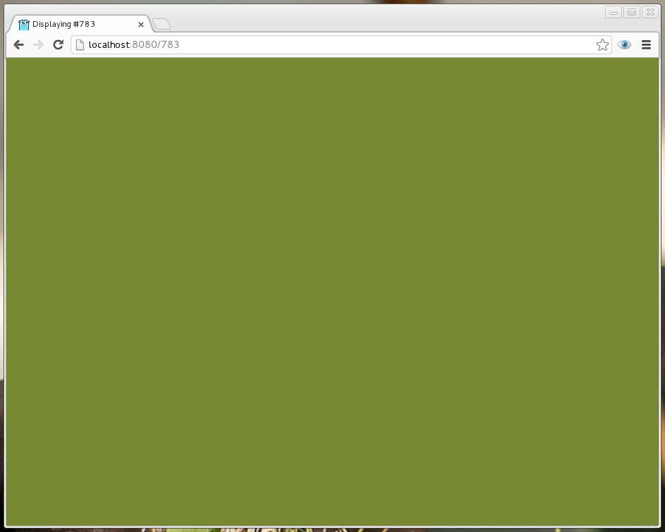

# Dalton.go

Go implementation of [Dalton](https://github.com/martriay/dalton).

Dalton is a simple, minimalistic and almost **useless** application created to display hex colors in a quick and easy way.

## Usage:

As hard as
```bash
go run dalton.go
```




